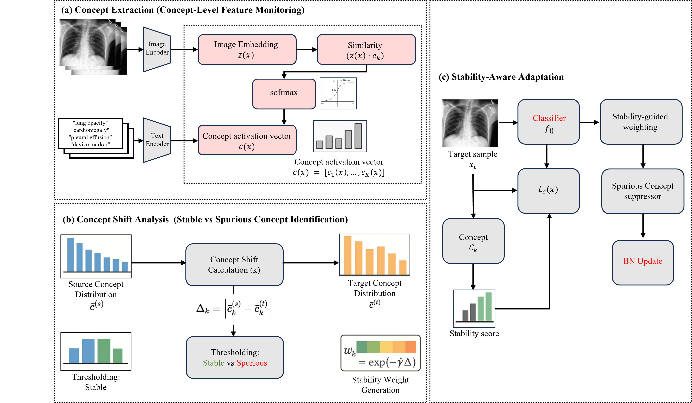

# EA-TTA: Explainability-Aware Test-Time Adaptation

Official implementation of **"Explainability-Aware Test-Time Adaptation via Concept-Guided Semantic Reliability"**

<div align="center">
  
</div>

## Overview

EA-TTA leverages vision-language models to distinguish stable concepts (pathology, anatomy) from spurious concepts (device markers, artifacts), guiding adaptation toward domain-invariant features during test-time.

**Key contributions:**
- Concept-distribution formulation for identifying stable vs. spurious concepts
- Stability-aware adaptation promoting stable concepts while suppressing spurious ones
- Concept-level metrics (SCR/SPR) quantifying semantic reliability beyond task accuracy

---

## 📌 Quick Start

```bash
# Setup
conda create -n EA-TTA python=3.10.13
conda activate EA-TTA
pip install -r requirements.txt

# Medical imaging (CheXpert→MIMIC)
python EA-TTA_medical.py --data_root /path/to/MIMIC --gpu 0

# Natural images (CIFAR-10-C)
python EA-TTA_cifar10c.py --gpu 0
```

---

## 📂 Repository Structure

```
EA-TTA/
├── EA-TTA_medical.py        # Medical image TTA (self-contained, ~730 lines)
├── EA-TTA_cifar10c.py       # CIFAR-10-C TTA (self-contained, ~830 lines)
├── concept_analysis.json   # Pre-computed concept weights (optional)
├── requirements.txt        # Dependencies
└── README.md              # This file
```

**Self-contained scripts:** Each file includes data loading, model definition, TTA algorithms, and evaluation.

---

## 🔬 Method

EA-TTA operates in three stages:

1. **Concept Extraction**: Extract semantic concept scores using vision-language models (CLIP/BiomedCLIP)
2. **Stability Analysis**: Quantify concept-level distribution shift between source and target to identify stable (low shift) vs. spurious (high shift) concepts
3. **Stability-Aware Adaptation**: Update BatchNorm parameters using stability-weighted entropy loss with spurious concept suppression

**Stability weight:** `w_k = exp(-γΔ_k)` where `Δ_k` measures concept shift

---

## ⚙️ Concept Analysis

### Online Mode (Default)
Computes concept shifts during adaptation:
```bash
python EA-TTA_medical.py --data_root /path/to/MIMIC --gpu 0
```
- No preprocessing required
- Works with any target domain

### Offline Mode (Better Performance)
Uses pre-computed concept weights:
```bash
python EA-TTA_medical.py --concept_json concept_analysis.json --data_root /path/to/MIMIC --gpu 0
```
- Faster inference
- Improved performance with calibration data

---

## 🎯 Medical Imaging Setup

**Dataset:** MIMIC-CXR (requires PhysioNet credentialed account)
- Download: https://physionet.org/content/mimic-cxr/2.0.0/

**Expected structure:**
```
/data/MIMIC/2.0.0/
├── files/p10/p10000032/...
├── mimic-cxr-2.0.0-metadata.csv.gz
└── mimic-cxr-2.0.0-chexpert.csv.gz
```

**Run:**
```bash
python EA-TTA_medical.py \
    --data_root /data/MIMIC/2.0.0 \
    --task Pneumonia \
    --clip_model ViT-B/32 \
    --gpu 0
```

**Arguments:**
- `--task`: Pathology name (Pneumonia, Effusion, Enlarged Cardiomediastinum)
- `--clip_model`: ViT-B/32, ViT-L/14, or biomedclip
- `--concept_json`: Path to pre-computed concept weights (optional)

---

## 🎯 General Images Setup

**Dataset:** CIFAR-10-C (auto-downloaded)

**Run:**
```bash
python EA-TTA_cifar10c.py --gpu 0
```

**Arguments:**
- `--epochs`: Training epochs for base ResNet-18 (default: 10)
- `--skip_train`: Skip training and load checkpoint
- `--checkpoint`: Path to pre-trained model (default: cifar10_resnet18.pth)
- `--clip_model`: ViT-B/32 or ViT-L/14
- `--concept_json`: Path to pre-computed concept weights (optional)

---


## 📊 Evaluation Metrics

- **Task Performance**: AUC (medical), Accuracy (CIFAR-10-C)
- **Concept Stability**: 
  - SCR (Stable Concept Reliance) ↑
  - SPR (Spurious Concept Reliance) ↓

**Key finding:** Standard entropy-based TTA can improve accuracy while degrading semantic reliability. EA-TTA maintains both task performance and concept stability.

---

